# AltTabProjects

Saved Projects and Desktop navigation in a dedicated AltTab app, distributed from the [horner fork](https://github.com/horner/alt-tab-macos).

[Download the friends beta](https://github.com/horner/alt-tab-macos/releases/tag/projects-v0.1.1), or install the prebuilt app with Homebrew:

```sh
if brew command trust >/dev/null 2>&1; then brew trust --cask horner/projects/alttab-projects; fi
brew tap horner/projects https://github.com/horner/alt-tab-macos.git
brew install --cask horner/projects/alttab-projects
```

Updates use `brew upgrade --cask horner/projects/alttab-projects` after `brew update`.

On first launch, Projects is enabled, each Desktop gets a linked Project, and its existing windows become members as discovery completes. Desktop and Project names come from their apps, with numbered fallbacks for empty entries. Space labels open behind other windows and appear for 1,500 ms when switching Spaces. Saved names, memberships, exclusions and settings are preserved.

The ZIP contains `AltTabProjects.app`, signed with Developer ID and notarized by Apple. Both Apple silicon and Intel architectures are included. Packaging and Gatekeeper checks were tested on macOS 26.6.2 / Apple silicon; behavior on other Macs is still being tested.

Quit other AltTab variants before opening AltTabProjects and grant Accessibility and Screen Recording access. This app uses a separate identity from AltTabDebug: export/import settings if desired, and activate Pro normally. The existing licensing behavior is retained.

Release source and packaging instructions live on [`projects-release`](https://github.com/horner/alt-tab-macos/tree/projects-release). This repository's default branch carries the Homebrew cask. Based on [AltTab](https://github.com/lwouis/alt-tab-macos); upstream information follows.

---

<div align="center">

<a href="https://alt-tab.app/"></a>

<a href="https://jb.gg/OpenSource"></a>

</div>
