# Projects phase screenshots

Native captures of the running Debug app.

**M2 baseline Spaces panel**

**M3 shared grid** — matching tile geometry, typography and highlight. Desktop 1/2 order changed after relaunch because visit history is session-local.

M3 settings and panel checks:

**Projects disabled** — only the enable switch is shown.

**Preset applied** — Option hold, Tab next, Shift previous, Focus release.

**Conflict warning** — a deliberate shared Option hold identifies Window shortcut 2; the full warning wraps.

**Project panel** — the current Desktop appears in the shared grid. This capture contains no custom Project; the live Research creation and cross-Space membership walkthrough remains pending.

These captures show actual Debug app UI, with no mock content or image edits.

**Phase 3 menu addition — requested behavior**

The annotated capture below shows the menu before this addition. The updated menu names the active Project and offers **Add this Window to Active Project** and **Add All Visible Windows to Active Project**. Under **Projects**, choose **New Project…** for an empty collection or **New Project from All Visible Windows…** to capture the current Desktop and activate the new Project after saving its name. Covered windows are included; minimized windows, hidden apps, other Desktops, and inactive tabs are excluded. This action is a one-time capture. Desktop linking, documented below, adds the subsequently requested automatic membership.

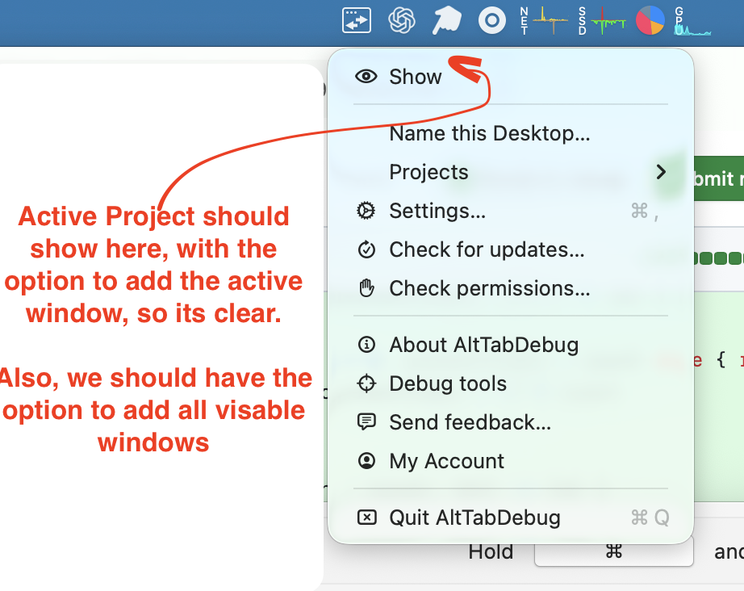

**Saved Desktop names in the Spaces switcher**

Tiles now show their Desktop number alongside the saved name. User names take priority over automatic app names; unnamed Desktops retain their original labels. The live capture confirms the saved Desktop 2 name survives relaunch and appears without clipping.

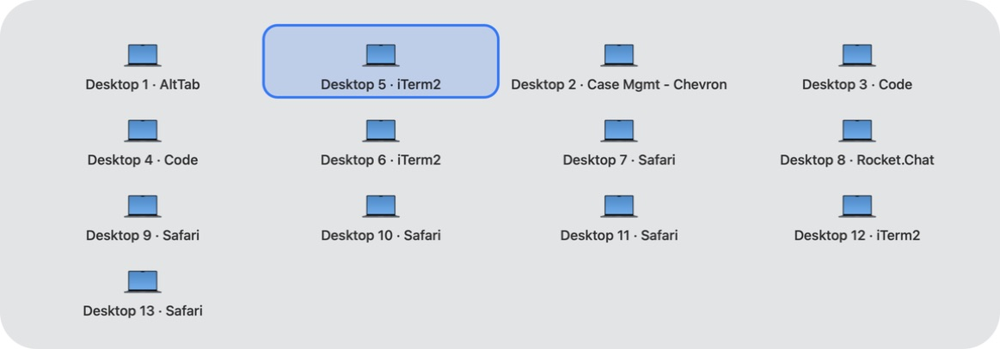

**Window details above the Desktop label**

The current layout uses the most recently focused eligible window's app icon and **app - window title** on the first line. A smaller second line shows **Desktop N** and any distinct explicit Desktop name. Long titles truncate within the grid; their full text remains in the tooltip and accessibility label. Empty Desktops keep a name and desktop-icon fallback.

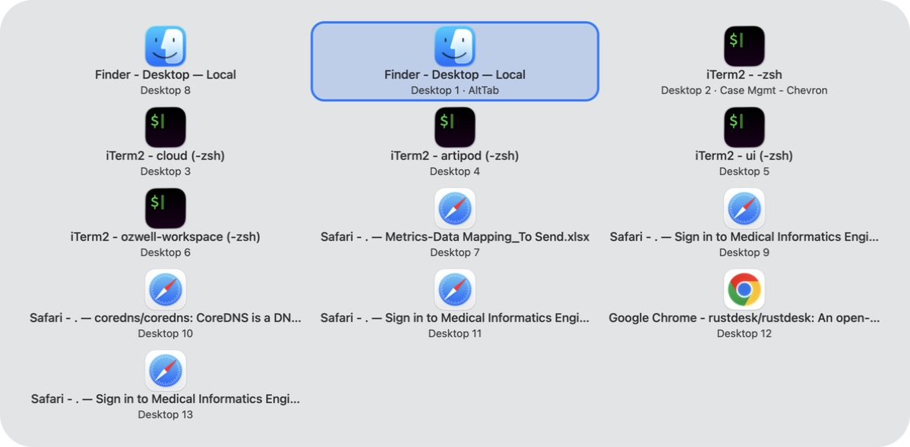

**Title-only refinement**

The primary line now contains only the window title. The app name appears with Desktop N in the smaller second line, beside any distinct custom Desktop name. The preceding screenshot documents the earlier app-and-title layout; a screenshot of this refinement is pending.

**Project menu navigation**

The active/no-active Project row now opens a submenu. It lists the active Project's windows and offers **Other Projects → Project → Activate Project / window**. Choosing a window selects its Project and focuses that window. **Use Desktop (No Project)** returns to normal window filtering. The bulk-add action names its destination: **Add all visible to: Research**. A live screenshot of this menu revision is pending.

**Main switcher context and named Desktop hierarchy**

The main window switcher now shows its Project or Desktop scope above the windows. Here the current Desktop is named “AltTab”.

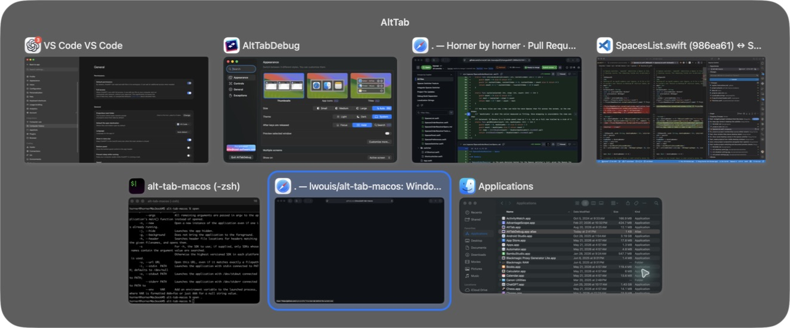

Named Desktop tiles put the explicit name first, with smaller `D:N - window title` below. Unnamed tiles show just `D:N - window title`. Desktop 3 shows the shared `cloud (-zsh)` title.

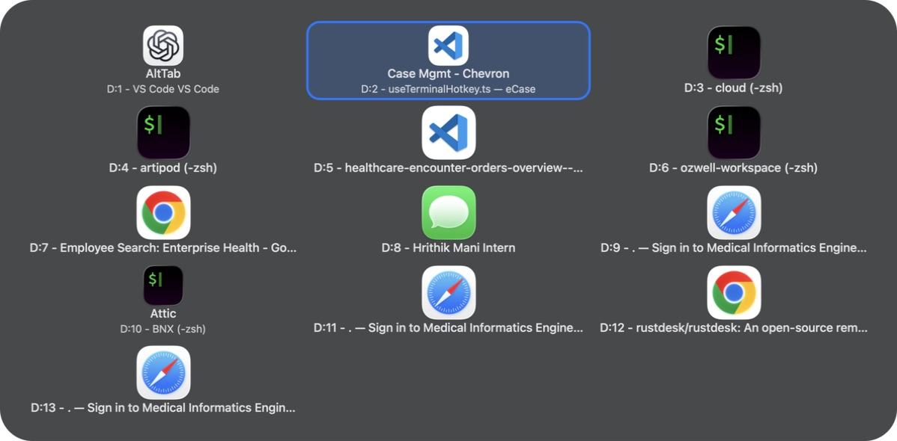

**Link a Desktop to a Project**

In **Name this Desktop…**, check **Link this Desktop to a Project**. Choose **Create a new Project** to use the Desktop name, or choose an existing Project. Each Desktop can link to one Project, and each Project to one Desktop. Linking enables Projects and includes existing and future windows on that Desktop, including hidden or minimized windows. You can still manually add windows from other Desktops. Unchecking the box removes the link and keeps the memberships. Links and memberships survive AltTab restarts.

This capture uses the production AppKit dialog with isolated sample data (“Research” and “Casework”); it does not modify your Desktops or Projects.

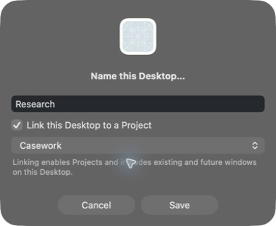

Desktop switches keep your active Project by default. In **Settings → Controls → Projects switcher**, enable **Switch active Project when switching Desktops** to select the destination Desktop’s linked Project automatically (or normal Desktop scope when unlinked). The setting is off by default; linked window membership works independently.

**Windows without a Project** in the menu bar lists windows from all Desktops that belong to no custom Project. Choose a title to focus that window. Hidden and minimized windows are included, so they remain reachable.

The rebuilt Debug app confirms Desktop following is off by default.

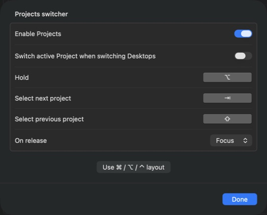

Project diagnostics use the existing debug logger. Open the Debug window before reproducing an issue, then use **Copy all**. Search for `projects ` to see menu requests/completions, target IDs, membership counts, identity restoration and removals. A `focus requested` entry records dispatch, not confirmed OS focus. Debug output can also be captured by launching the app executable with `--logs=debug` and redirecting its output to a file.

Newly created windows (for example Chrome **⌘N**) on the current Desktop join the active custom Project while Projects is enabled, after the owning app’s first 30 seconds. Saved assignments and linked Desktop assignments take priority; automatic capture does not add an already assigned window to another Project. Existing windows rediscovered during startup or tracking refresh do not join the active Project. Diagnostic entries identify this path as `source=window-created`.

Use the top-level **Add active window to → Project** menu to assign the focused window directly to any custom Project, including when no Project is active. The current Project selection is preserved.

In **Settings → Controls → Projects…**, **Show from active Project** defaults to **All Spaces/Screens**. Active Project members then appear across Desktops and displays even if the ordinary Filtering settings say “Visible Spaces.” Choose **Current Space/Screen** to restrict them to the current Desktop and main screen. Other filters (such as hidden/minimized windows) remain in effect. Without an active custom Project, ordinary Filtering settings apply.

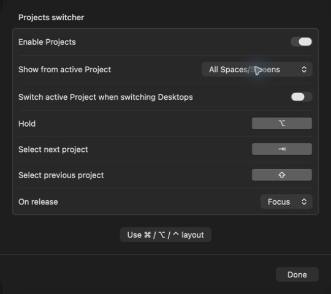

**Adding windows already in another Project**

The single-window and **Add all visible** actions ask once when any selected window already belongs to another Project. **Move** is the default (Return): it removes the selected windows from their other Projects and adds them to the destination. **Keep in Both** explicitly retains the old memberships. **Cancel** (Escape) changes nothing, including unassigned windows in a mixed batch. No prompt appears without conflicting memberships.

An explicit move also prevents linked-Desktop capture from adding that window back to its source Project, including after an AltTab restart. Explicitly adding it back clears that exclusion. The dialog below uses production UI with isolated sample membership data.

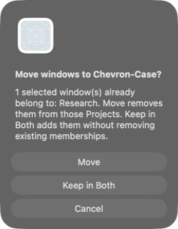

**Switch Projects inside the window switcher**

A compact numbered strip sits beneath the context title. Click a Project or press its displayed digit (1–9, then 0) to update the windows in place. **1** returns to normal Desktop filtering; custom Projects follow in creation order. **All Projects** opens a compact, scrollable grid, including unnumbered, click-only Projects after the tenth entry. Opening the grid keeps the switcher open after releasing the hold key; select a window and press Return to focus it, or Escape to dismiss. While editing search, numbers remain search text.

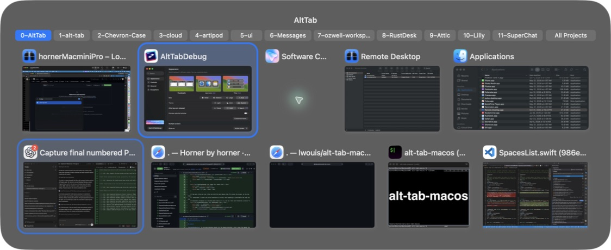

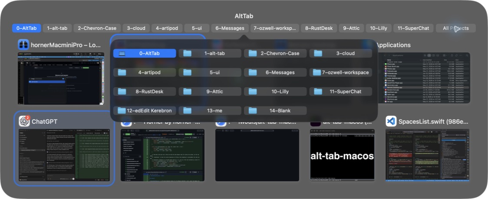

The numbered strip now follows keyboard order **1–9, then 0**. Later entries show only their names. Pointer clicks on the strip and grid use the switcher’s mouse-event routing; pressing on one button and releasing elsewhere cancels the click. Earlier screenshots above show the superseded numbering.

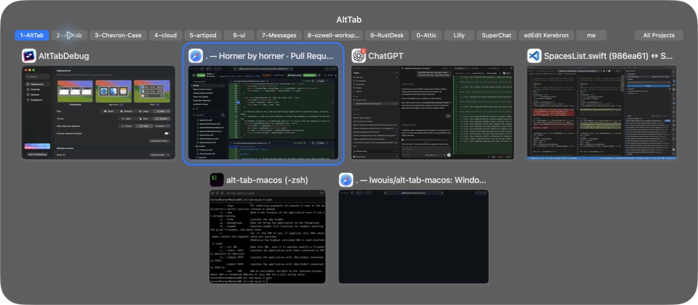

A physical Lilly click exposed a hit-area bug: AppKit reported the whole panel as the first button’s visible region. Hit areas now intersect that region with each button’s bounds, so a click selects the button under the pointer. The regression tests include the captured Lilly coordinates and scrolled grid clipping.

**Restoring assignments after app restarts and reboot**

Membership now stores exact app identifiers and window titles as well as live window identities. A reopened window with one matching Project rejoins it before automatic assignment runs. Closing an app retains these patterns. Explicit removal records an exclusion that also survives reboot.

History also records stable Desktop UUIDs. When a title changes, one matching app/Desktop history can restore its Project. Desktop context distinguishes identical titles in different Projects; conflicting history still requires a manual assignment. During an app’s first 30 seconds, new windows do not join the active Project, including manually created windows in that interval. Linked Desktop capture still works and respects saved assignments.

The first reboot recovery imported patterns from the pre-reboot snapshot and event log. This capture shows two reopened terminal windows restored to artipod. Some windows were not reopened, had changed titles, or had conflicting assignments. A second reboot verification of the new code remains pending.

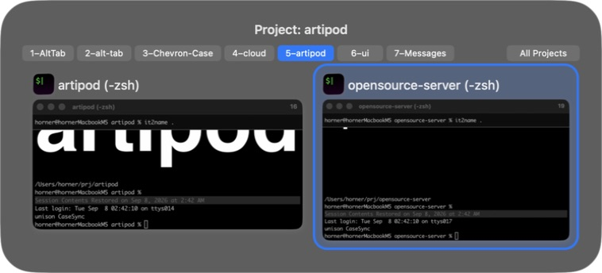

Restoration displays a brief, non-activating notice grouped over one second. Each entry shows the window title above **→ Project name**, with **(different Desktop)** when applicable. Up to five entries appear for six seconds, followed by further pages for larger batches. Empty titles use the app name. This restores assignments without moving the windows between Desktops.

**Project window history**

Open the active Project’s menu → **History**, or **Other Projects → Project → History**. Each remembered title shows **Open now** or how long ago AltTab last observed it. Open entries can be selected to focus the window. Past Safari/Chrome entries with a saved URL show **Reopen**: click the title or its URL to open it in the original browser. Entries without a usable web URL remain read-only. Tooltips show the full title, app identifier, and timestamp. Duplicate title observations are grouped using their latest timestamp.

History survives app closure and explicit moves/removals. It is separate from restoration rules, so a past entry does not automatically rejoin a Project it was removed from. Older observations without a timestamp show **Last seen unknown**. The initial recovery history uses timestamps from the saved event log where available.

Gather was removed after a controlled cross-process test could not move a test window between Desktops. Project selection, window focusing, history, and assignment restoration remain available.

**Browser URLs in Project history**

Safari and Chrome entries include the observed active-tab URL below the window title in the active Project, Other Projects, Windows without a Project, and History menus. AltTab reads document accessibility metadata in the background when windows are discovered, titles refresh, or the menu opens. It does not inspect page contents or unfinished address-bar text. A fresh menu read may appear the next time you open History.

Restoration prefers an exact app/URL match, so a changed or sign-in title can still recover its Project. Shared URLs use saved Desktop context; ambiguous matches stay unassigned. Earlier observed URLs remain saved as tabs navigate. Existing assigned windows keep their Project when their URL changes, and explicit moves/removals still take priority.

Capture covers the active tab of each window, not every background tab. If the browser exposes no URL, existing title/Desktop recovery applies. A redirect destination is only known if AltTab observed it previously; this cannot reconstruct an unseen original URL. Stored web URLs omit embedded credentials and common transient authentication parameters, while document queries and routes remain part of matching. URL values are not included in debug logs.

**Assignment checkmarks**

In **Add active window to → Project**, a checkmark identifies each Project that already contains the focused window. The direct **Add active window to: Project** action shows the same membership state. Checked entries remain selectable; the marker reports window membership, not which Project is active.

Reopening uses the browser’s normal URL-opening behavior, so it may open a tab in an existing window. It does not recreate the original tab collection, browser profile, or Desktop, and does not reassign an existing window from another Project. New windows use the usual Project recovery rules. If the original browser cannot open the address, AltTab displays an error.
