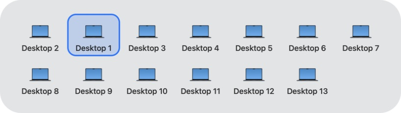
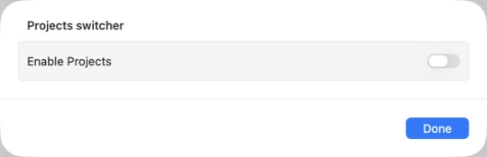
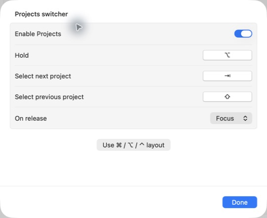
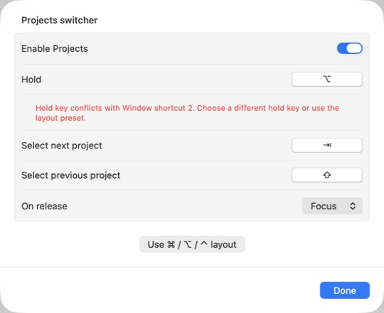
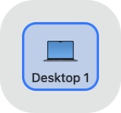

# Projects phase screenshots

Native captures of the running Debug app.

**M2 baseline Spaces panel**

**M3 shared grid** — matching tile geometry, typography and highlight. Desktop 1/2 order changed after relaunch because visit history is session-local.

M3 settings and panel checks:

**Projects disabled** — only the enable switch is shown.

**Preset applied** — Option hold, Tab next, Shift previous, Focus release.

**Conflict warning** — a deliberate shared Option hold identifies Window shortcut 2; the full warning wraps.

**Project panel** — the current Desktop appears in the shared grid. This capture contains no custom Project; the live Research creation and cross-Space membership walkthrough remains pending.

These captures show actual Debug app UI, with no mock content or image edits.
