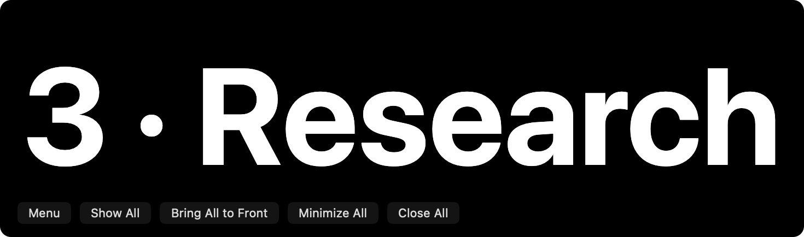

# Space labels

Native AppKit render of the production label: one bold white line on solid black, using half the
screen’s usable width. The font fills the available width and the window height follows the text.
New windows start at the lower-right corner, inset 24 points from the screen's usable edges. Users
can drag the title bar or background; each label remembers its display and position across label
recreation and app restarts. Disconnected displays fall back to the owning screen, with placement
kept inside the usable area. On the current screen, “3 · Research” uses a 735 × 217 point window.
Native close and minimize buttons stay above the text at the upper left. Very long names
truncate before the font becomes too small; the full name remains in the tooltip and accessible title.

AltTab’s menu, **Settings → Controls → Projects**, and the buttons below each label provide four actions:

- **Show Space Labels** creates the set and restores individually closed labels.
- **Bring Space Labels to Front** raises the existing set once and restores minimized labels. It also creates the set if no label session exists.
- **Minimize All Space Labels** minimizes the set; the yellow button minimizes just one label.
- **Close All Space Labels** removes the set; the red button closes just one label.

The window buttons use the shorter names Show All, Bring All to Front, Minimize All and Close All;
all four operate on the whole set. Native close/minimize controls operate on just their own label.
A **Menu** button opens the same live AltTab menu as the menu-bar icon, including Settings, Projects,
updates and Quit. **Project windows in switcher** offers **Show** and **Hide**, defaulting to Hide
independently of the menu-bar icon. Show includes open labels in AltTab's window list, including during
a temporary reveal. Preference changes update existing labels without recreating them.
Labels bypass custom-Project membership filtering and do not automatically become Project members;
the usual app, Space, screen and minimized-window filters still apply.

**Show label after switching Spaces** sets an optional 0–3000 ms reveal in 100 ms steps. It defaults
to 1500 ms. Zero disables it, and explicitly saved durations are preserved. After arriving on a different Space, its open, non-minimized labels rise to the
floating level, without taking keyboard focus. The original level and front/back presentation return
after the interval. Closed and minimized labels stay hidden. Repeated notifications do not restart
the interval; rapid switching cancels older timers. Interacting with a label or its buttons supersedes
the timer, and clicking elsewhere dismisses the temporary reveal. Destination-app activation during
the Space transition does not dismiss the cue.

Outside a temporary reveal, clicking outside the labels or switching to another app sends them behind ordinary windows. They
remain open for Exposé. Routine name/Space refreshes do not raise or restore them. Closing one label
keeps it closed until another Show request. Labels start hidden after restarting AltTab.

[AppKit’s normal-level back ordering](https://developer.apple.com/documentation/appkit/nswindow/orderback(_:))
preserves open windows without changing keyboard focus. Local and global mouse monitors handle
clicks in AltTab and other apps; workspace activation handles app switching. Monitors stop after the
labels move back, minimize or close. Revision checks cancel outdated batches and deferred clicks.

Validation: 115 tests cover label behavior, window admission and ordinary switcher filters. Native
AppKit checks verified the menu button and four label actions, conditional accessibility subroles,
live Show/Hide rediscovery and admission updates, default placement, rename
stability, saved-position recreation, timed level restoration without changing the active application,
minimized-set suppression, manual-action precedence and cleanup. The image renders the production
window's content view. Live Space-transition animation, fullscreen and multiple-display behavior
still need an interactive check.

The label Menu button was verified to open the full menu, including Settings. The rebuilt app was
restarted and the Project windows in switcher dropdown was checked with both Show and Hide, then
returned to Hide. The menu-bar icon stayed enabled, and the saved 1600 ms reveal duration was preserved.

A Desktop can link multiple Projects through **Name this Desktop → Projects on this Desktop**.
Closing a Desktop moves its Projects to the destination Desktop without combining memberships.
Each Project keeps its own label window, identity and saved placement; colliding migrated labels
are repositioned so both can be seen. The Spaces view displays both Project names. Existing windows
are reused, and closing or minimizing one label leaves the other label alone. With Follow Desktop
enabled, returning to a shared Desktop selects its first claimant. Explicitly choosing another
linked Project is preserved while staying on that Desktop. Display disconnection and exiting
fullscreen do not merge Projects.

The merge change passed 175 focused tests and a production-adapter simulation checking separate
memberships, window reuse, both reveal timers, label closure, legacy decoding and persisted links.
No real user Desktop was deleted during validation.

**Naming a Desktop and showing Project Labels (2026-09-09)**

The controls now say **Project Labels**, since several Projects can share a Space. The old naming
alert activated AltTab before entering an app-modal loop, allowing its other windows to pull focus
to another Desktop. The replacement uses a nonactivating AppKit panel with keyboard focus on the
current Desktop. Save closes the panel before applying its changes; Cancel, Escape and close leave
the Desktop untouched. Saving after that Desktop has been removed is ignored.

Saving also explicitly shows or restores the edited Desktop's Project Labels. Previously it only
saved the name and links, so a closed label session stayed closed. The scoped request opens all linked
Projects on that Desktop without opening or restoring labels elsewhere. Show Project Labels still
opens the complete set. Saved placement and reveal-duration preferences retain their existing keys.

Validation: the Debug build and 66 focused tests pass. A production-source AppKit fixture verifies
key focus with the foreground app and active Space unchanged, usable panel geometry, Save creating
and displaying the scoped label, Cancel leaving it closed, and a removed Desktop rejecting Save.
The live menu and settings use the new terminology, and label windows were restored after restart.

**Desktop numbering and Project claim order (2026-09-09)**

With multiple Desktops, the numbered strip and All Projects grid show Desktop numbers, including
the same number for Projects sharing a Desktop. Their claim order determines which Project a digit
or Desktop arrival selects. Saving links retains that order, and merged Projects follow the
destination's existing claimants. A single Desktop retains individual Project shortcuts 1–9 and 0.

Validation: the Debug build and 126 focused tests pass. A production registry fixture also checks
numbering, explicit links taking precedence over old home locations, claim order persistence,
Desktop arrival, manual selection, primary removal, Desktop merging and single-Desktop shortcuts.
The restarted app's live buttons show the expected Desktop numbers and duplicate shared numbers.

**Moving a Project Label between Desktops (2026-09-09)**

A Project follows its label window when that window moves to another Desktop. WindowServer
membership events, Desktop arrival and Mission Control exit recheck the label's actual Space.
The destination keeps its existing Projects first; the arriving Project retains its members,
history, identity and label window. Ambiguous locations and unfinished app assignments are ignored.

The reported Desktop 1 label was physically on Desktop 1 while its Project still linked Desktop 2.
The new controller detected the move and saved the correct link. After restarting, WindowServer
confirmed the label on Desktop 1, its title read **Desktop 1 · Desktop 1**, and the strip showed
**1–Desktop 1** and **2–Desktop 2**. The Debug build, 126 focused tests and a production controller
fixture pass, including preserved claim order and rejection of stale location observations.
